# Monitoring RabbitMQ for PCF using Datadog

This guide is meant for development teams who wants to create custom Dashboards to gain visibility into their RabbitMQ cluster to track status and performance. The guide targets [RabbitMQ for PCF](https://docs.pivotal.io/rabbitmq-cf/1-15/) therefore all the instructions assumes developers are working in Cloud Foundry and using RabbitMQ for PCF. Despite of that, the guidelines on how to monitor RabbitMQ with Datadog are valuable outside of Cloud Foundry too.

To summarise it, the goal of this guide is to:
- guide a *PCF Operator* on how to install **Datadog for PCF**
- guide a *PCF Developer* on how to monitor their RabbitMQ cluster using **Datadog** **dashboards** and **monitors**

As said earlier, this guide is meant for development teams who have different monitoring requirements compare to operator(s)/administrator(s) who sees RabbitMQ as another piece of infrastructure.

An example of their difference is that a developer may want to set an alert on a given queue depth whereas an operator would set an alert when disk space is exceeding certain threshold. Certainly we can say that the operator's monitoring requirements are a subset of the developer's monitoring requirements.

**Table of Content**

- [Install Datadog Product in PCF](#Install-Datadog-Product-in-PCF)
- [Inspect RabbitMQ Metrics from PCF](#Inspect-RabbitMQ-Metrics-from-PCF)
- [Monitor RabbitMQ cluster](#Monitor-RabbitMQ-cluster)
  - [Identify metrics for RabbitMQ service instance](#Identify-metrics-for-RabbitMQ-service-instance)
  - [Create dashboards](#Create-dashboards)
    - [Configure Template Variables](#Configure-Template-Variables)
    - [Dashboard group - RabbitMQ Availability](#dashboard-group---rabbitmq-availability)
    - [Dashboard group - Messaging Health](#dashboard-group----messaging-health)
    - [Dashboard group - Resource Utilization per node](#dashboard-group---resource-utilization-per-node)
    - [Dashboard group - Load](#dashboard-group---load)
    - [Dashboard group - Throughput](#dashboard-group---throughput)
    - [Dashboard group - Workload Specific](#dashboard-group---workload-specific)
    - [Dashboard group - Mirroring (Optional)](#dashboard-group---mirroring-optional)
    - [Dashboard group - Network (Optional)](#dashboard-group---network-optional)
    - [Dashboard group - Federation and Shovels (Optional)](#dashboard-group---federation-and-shovels-optional)
  - [Development workflow using one dashboard per RabbitMQ Service Instance](#Development-workflow-using-one-dashboard-per-RabbitMQ-Service-Instance)
  - [Development workflow using one dashboard for many RabbitMQ Service Instances](#Development-workflow-using-one-dashboard-for-many-RabbitMQ-Service-Instances)
  - [Uploading and downloading dashboards](#Uploading-and-downloading-dashboards)
  - [Set up alerts](#Set-up-alerts)
    - [One monitor per service instance vs one for all service instances](#One-monitor-per-service-instance-vs-one-for-all-service-instances)
    - [Tagging our monitors](#Tagging-our-monitors)
    - [Messaging service availability monitor](#Messaging-service-availability-monitor)
    - [Messaging service correctness monitor](#Messaging-service-correctness-monitor)
    - [Back-office transaction processing monitor](#Back-office-transaction-processing-monitor)
    - [See monitors in action](#See-monitors-in-action)
  - [RabbitMQ Limits and Guard Rails](#RabbitMQ-Limits-and-Guard-Rails)
- [Testing dashboards and alerts](#Testing-dashboards-and-alerts)

# Install Datadog Product in PCF

This is a quick, step-by-step, guide on how to install Datadog on PCF. However, you can find
**Datadog** PCF Product and official installation instructions [here](https://docs.pivotal.io/partners/datadog/installing.html)
or even [here](https://www.datadoghq.com/blog/pcf-monitoring-with-datadog/).

From now on, we will use the term **Datadog** to refer to **Datadog Product for PCF**.

**Prerequisites**:
- We need a PCF foundation installed
- We need an OpsManager administrator user so that we can either access Ops Manager UI or API
- We need a Datadog user that can access **Datadog API keys**

After we complete the steps on this section we will have the following:
- A single **Datadog Agent** running in a VM and connected to Datadog API servers. Typically, we need to install a **Datadog Agent** on every host we wish to monitor. However, In PCF we only need one **Datadog Agent**.
- A **PCF Firehose nozzle for Datadog** which receives metrics from PCF (this includes the entire PCF platform including all the RabbitMQ service instances) and sends them to the **Datadog Agent** above.


## 1. Examine Datadog versions available in [Pivotal Network](https://network.pivotal.io/)

We have opted to use the command-line program, [pivnet-cli](https://github.com/pivotal-cf/pivnet-cli), to list products in [Pivotal Network](https://network.pivotal.io/) and download them. However, we can do it directly from the browser.

```bash
pivnet releases -p datadog
```
It outputs which versions are available:
```
+--------+---------+--------------------------------+--------------------------+
|   ID   | VERSION |          DESCRIPTION           |        UPDATED AT        |
+--------+---------+--------------------------------+--------------------------+
| 334319 | 2.8.0   | Includes Datadog firehose      | 2019-03-29T16:39:20.935Z |
|        |         | nozzle version 71              |                          |
...
```

## 2. Download Datadog version we want to install

We are installing the latest, `2.8.0`. As we explained in the previous step, we are using [pivnet-cli](https://github.com/pivotal-cf/pivnet-cli) but you can use the browser instead.


```bash
pivnet download-product-files -p datadog -r 2.8.0 -g "*datadog*"
```

## 3. Upload Datadog onto OpsManager

We are using the command-line program called [om](https://github.com/pivotal-cf/om) to install the downloaded Datadog product onto OpsManager. We can do it also via the browser.

```bash
om upload-product -p datadog-2.8.0.pivotal
```

## 4. Import Datadog product

Via the browser, we navigate to the Ops Manager Installation Dashboard and click *+* next to the version number of **Datadog Cluster Monitoring for PCF** found on the left menu.


## 5. Configure Datadog | Assign AZ and Networks

We click on the newly added *Datadog Cluster Monitoring for PCF* title.

1. Select menu option **Assign AZ and Networks**
2. Select one of the zones to place *singleton jobs*
3. Select at least one zone where to *balance other jobs*
4. Choose a network. We can choose the *??-pas-??* network.

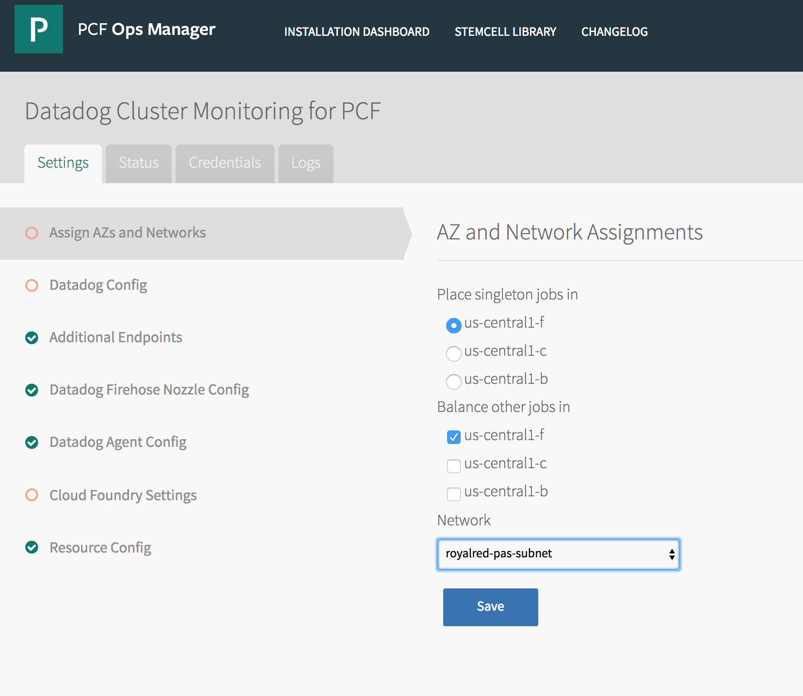

## 6. Configure Datadog | Datadog Config

We move onto the next menu option, *Datadoc Config*.

1. First of all, we need to login to **DataDog** UI, click on `Integrations|APIs` and copy the *API key* you wish to use and paste it into the *Datadog API Key* field

    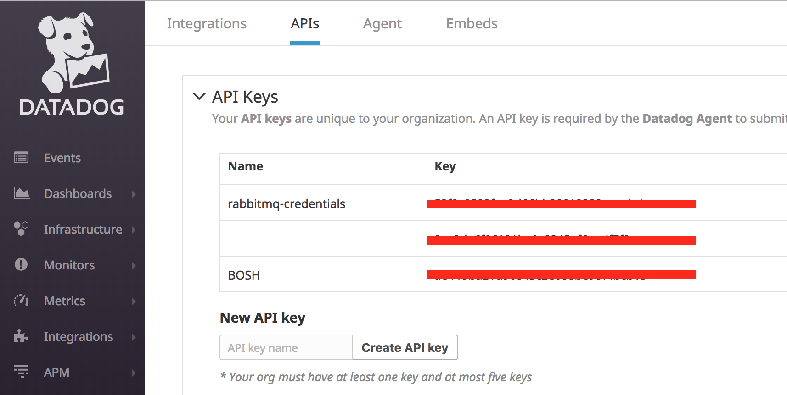
2. Back to the OpsManager UI, enter a tag that allows us to easily identify the metrics coming from this PCF environment.
   e.g: if your environment is called `royalred` enter `env:royalred`

    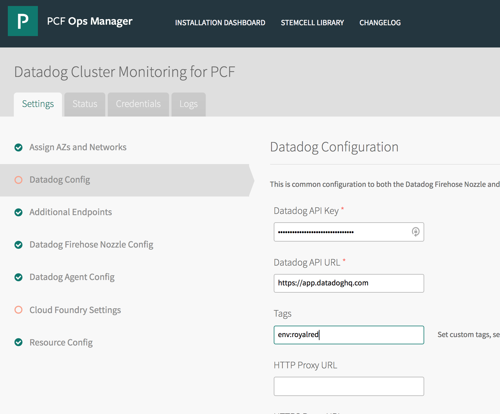

## 7. Configure Datadog | Cloud Foundry Settings

We need to create an OAuth Client for **Datadog Noozle** to connect to Cloud Foundry so that it receives metrics.

1. We need to gather the domain URL where **UAA** server runs.

    Navigate to the OpsManager Installation Dashboard and onto the **Small Footprint PAS** tile. Click on *domains* and copy the content of *System Domain* field.
    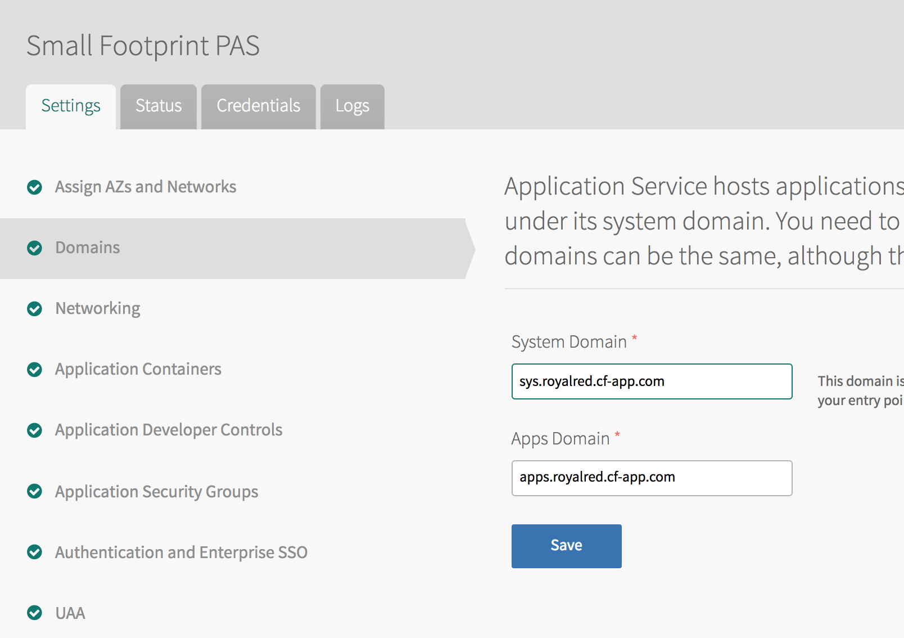

    In this sample, **UAA** is running at `uaa.sys.royared.cf-app.com`.

2. We need to gather the `Admin Client Credentials` to access **UAA**.

    Within **Small Footprint PAS** tile, click on *Credentials* tab, search for `UAA`, find `Admin Client Credentials` and click on `Link to Credential` and copy the username and password.

    
    

3. Target `uaac` to point to **UAA**.

    We need to have [uaac](https://docs.pivotal.io/pivotalcf/uaa/uaa-user-management.html) command-line installed.
    Run the following command:

    ```bash
    uaac --skip-ssl-validation target uaa.sys.royalred.cf-app.com
    ```

    It should print out:
    ```
    Unknown key: Max-Age = 86400

    Target: https://uaa.sys.royalred.cf-app.com
    ```

4. Login to UAA using `Admin Client Credentials`:

    Run the following command using the *username* and *password* we obtained in step #2:
    ```bash
    uaac token client get <username> -s <password>
    ```

    It should print out:
    ```
    Unknown key: Max-Age = 86400

    Successfully fetched token via client credentials grant.
    Target: https://uaa.sys.royalred.cf-app.com
    Context: admin, from client admin

    ```

5. Create OAuth client for Datadog so that it can connect to PCF to consume metrics:

    ```
    CLIENT_SECRET="XXXXXYYYYYXXXXXX"
    uaac client add datadog-firehose-nozzle \
        --name datadog-firehose-nozzle \
        --scope doppler.firehose,cloud_controller.admin_read_only,oauth.login \
        --authorities doppler.firehose,cloud_controller.admin_read_only,openid,oauth.approvals \
        --authorized_grant_types client_credentials,refresh_token \
        --access_token_validity 1209600 \
        -s $CLIENT_SECRET
    ```
    > CLIENT_SECRET should not have white-spaces like "my key"

    It should print out:
    ```
    scope: cloud_controller.admin_read_only doppler.firehose oauth.login
    client_id: datadog-firehose-nozzle
    resource_ids: none
    authorized_grant_types: refresh_token client_credentials
    autoapprove:
    access_token_validity: 1209600
    authorities: cloud_controller.admin_read_only doppler.firehose openid oauth.approvals
    name: datadog-firehose-nozzle
    required_user_groups:
    lastmodified: 1554882539000
    id: datadog-firehose-nozzle
    ```

6. Back to the OpsManager Datadog UI, enter the client_id which is **datadog-firehose-nozzle** and client secret which is the value we set in `CLIENT_SECRET` env var.

    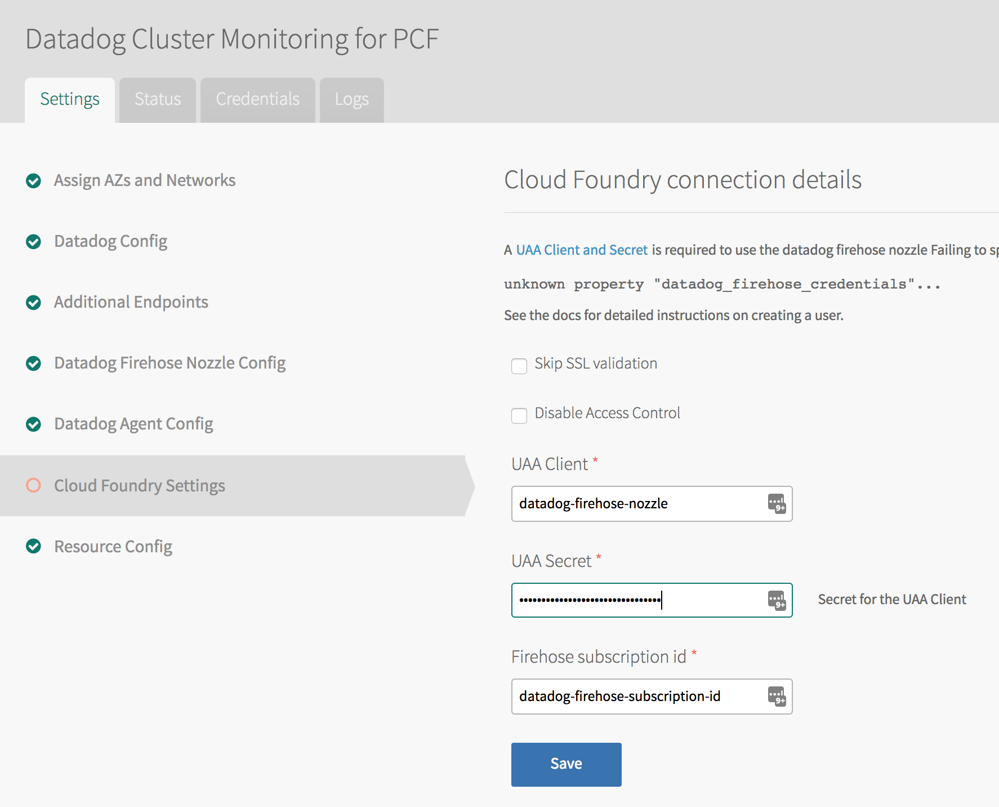

## 8. Complete the installation

Return to the Ops Manager Installation Dashboard and click **Apply Changes** to install Datadog Cluster Monitoring for PCF tile.
Deselect all products except **Datadog** and **BOSH Director**.

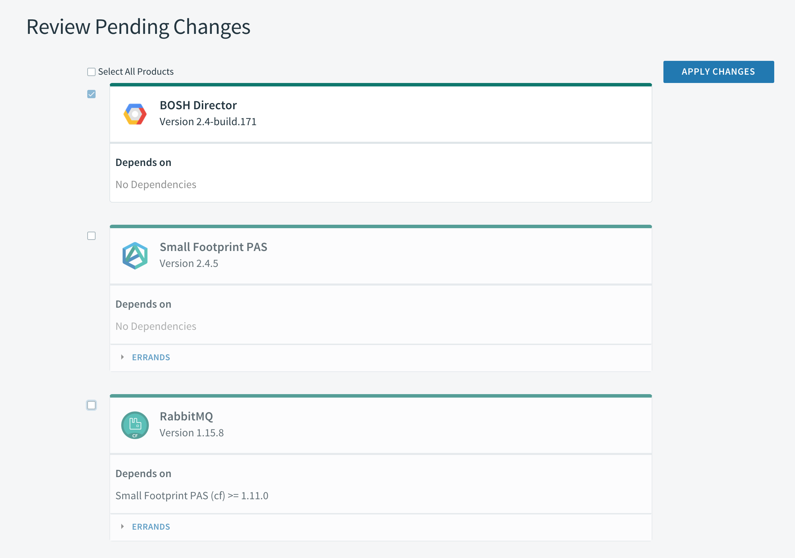

Once the installation completes, we go back to OPsManager Installation dashboard where we can see **Datadog** ready.


## Inspect RabbitMQ Metrics from PCF

This step is not essential to set up Datadog so you can skip it. With this step we are ensuring that RabbitMQ for PCF is sending the metrics that we will use from Datadog.

1. Install the required **cf CLI plugin** by running the following command:
    ```bash
    cf install-plugin -r CF-Community "log-cache"

    ```
    For more details, check out https://docs.pivotal.io/rabbitmq-cf/1-15/use.html#log-cache

2. To get the last metrics reported by the RabbitMQ service instance, run the following command:
    ```bash
    cf tail <RabbitMQ-SERVICE-INSTANCE-NAME>
    ```

    It should print out several lines like this one below:

    ```
    2019-04-03T15:25:15.24+0200 [rmq] GAUGE
      /p.rabbitmq/rabbitmq/channels/count:0.000000 count
      /p.rabbitmq/rabbitmq/connections/count:0.000000 count
      /p.rabbitmq/rabbitmq/consumers/count:0.000000 count
      /p.rabbitmq/rabbitmq/erlang/erlang_processes:396.000000 count /p.rabbitmq/rabbitmq/erlang/reachable_nodes:1.000000 count /p.rabbitmq/rabbitmq/exchange/dd74e97d-3b0d-4221-95b3-cae7c38be0a2/count:7.000000 count /p.rabbitmq/rabbitmq/exchanges/count:7.000000 count
      /p.rabbitmq/rabbitmq/heartbeat:1.000000 boolean
      /p.rabbitmq/rabbitmq/messages/available:0.000000 count
      /p.rabbitmq/rabbitmq/messages/delivered:0.000000 count
      /p.rabbitmq/rabbitmq/messages/delivered_noack:0.000000 count /p.rabbitmq/rabbitmq/messages/delivered_rate:0.000000 rate
      /p.rabbitmq/rabbitmq/messages/depth:0.000000 count
      /p.rabbitmq/rabbitmq/messages/get_no_ack:0.000000 count
      /p.rabbitmq/rabbitmq/messages/get_no_ack_rate:0.000000 rate
      /p.rabbitmq/rabbitmq/messages/pending:0.000000 count /p.rabbitmq/rabbitmq/messages/pending_acknowledgements:0.000000 count /p.rabbitmq/rabbitmq/messages/published:0.000000 count
      /p.rabbitmq/rabbitmq/messages/published_rate:0.000000 rate
      /p.rabbitmq/rabbitmq/messages/redelivered:0.000000 count /p.rabbitmq/rabbitmq/messages/redelivered_rate:0.000000 rate
      /p.rabbitmq/rabbitmq/queues/count:0.000000 count
      /p.rabbitmq/rabbitmq/system/disk_free:4621.000000 MB
      /p.rabbitmq/rabbitmq/system/disk_free_alarm:0.000000 bool /p.rabbitmq/rabbitmq/system/disk_free_limit:2989.000000 MB /p.rabbitmq/rabbitmq/system/file_descriptors:71.000000 count
      /p.rabbitmq/rabbitmq/system/mem_alarm:0.000000 bool
      /p.rabbitmq/rabbitmq/system/memory:76.000000 MB
      /p.rabbitmq/rabbitmq/vhosts/count:1.000000 count
    ```

**TL;DR** This CF plugin does not trace all the metrics emitted by RabbitMQ for PCF. All metrics emitted by RabbitMQ for PCF are documented [here](https://docs.pivotal.io/rabbitmq-cf/1-15/monitor.html#rabbitmq-metrics).


# Monitor RabbitMQ cluster

As a *PCF developer* we have created an On-Demand RabbitMQ service instance and we are about to create dashboards and alerts (known as **monitors** in Datadog) to monitor it.  

> The RabbitMQ Service instance can be a single node or a cluster depending on the service plan used to create the service instance

> The metrics polling interval defaults to 30 seconds. The metrics polling interval is a configuration option on the RabbitMQ tile (Settings > RabbitMQ). The interval setting applies to all components deployed by the tile. For more information check out the official [docs](https://docs.pivotal.io/rabbitmq-cf/1-15/monitor.html#metrics).

## Identify metrics for RabbitMQ service instance

In Datadog UI, go to `Metrics` menu option and select `Summary` option. All the metrics coming from **Cloud Foundry** will be prefixed with `cloudfoundry.nozzle`. And all the metrics coming from RabbitMQ On-Demand service will be prefixed with `cloudfoundry.nozzle.p.rabbitmq`. All metrics coming from RabbitMQ Pre-Provision service will be prefixed with `cloudfoundry.nozzle.p_rabbitmq`. In this guide we will use the former.

  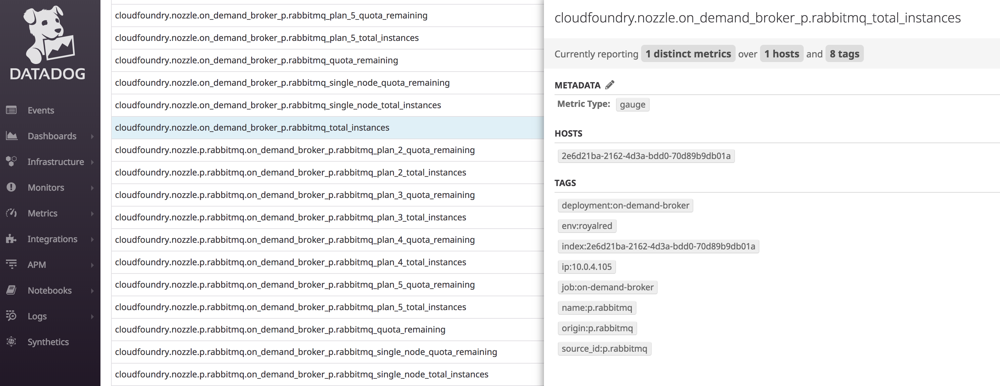

We need to filter the metrics emitted from our service instance. There could be many service instances and yet we could be monitoring multiple PCF foundations with their own service instances.

All the metrics emitted from our RabbitMQ service instance will have at least the following tags:
  - the *environment*. e.g.  `env: royalred`
  - the *deployment*. e.g. `deployment: service-instance_<guid>`
  > source_id tag's value matches exactly the <guid> therefore we could also use source_id if we wanted

Run the following command to know the *service instance guid* for our service instance.

```bash
cf service rmq --guid
```

It prints out something like this:
```
dd74e97d-3b0d-4221-95b3-cae7c38be0a2
```

If we are able to find metrics for our own service instance via this **Metrics explorer** we can reference them from the dashboards we are about to create.


## Create dashboards

At the end of day we need to ask ourselves *What we need from a dashboard*, or *why we do it* to later on decide on *how to do it*.

We are going to create the following sample dashboard attending to those principles. We are going to structure the dashboards into groups or categories. Each group or category addresses one or several needs. For instance, we definitely want to know if RabbitMQ is available for our applications. Hence, we need a dashboard group called [RabbitMQ Availability](#Dashboard-group---RabbitMQ-Availability) that tells us about RabbitMQ Availability or its healthiness in general.

Below is the sample dashboard we are going to create.

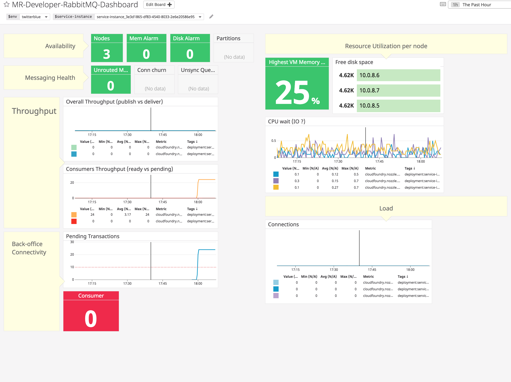

We are not going to explain step by step how to use Datadog UI to create this dashboard. Instead, we will dedicate one section fo each dashboard group we see in the sample dashboard above. Each section describes what metrics it includes and not how it is done. You can find out how it is done by importing this sample dashboard in your Datadog account and inspect its content.
  > If you want to go ahead now, download this [dashboard](dashboards/7rd-sje-w2h.json) definition file and go to this [section](#Uploading-and-downloading-dashboards) to find out how to import it into your Datadog account

We are going to start creating a dashboard from scratch. If you have any doubts on how to create a dashboard in DataDog follow this [link](https://docs.datadoghq.com/graphing/dashboards/#create-a-dashboard). We are going to create a [Screenboard](https://docs.datadoghq.com/graphing/dashboards/screenboard) dashboard because it gives us the flexibility we need for our sample dashboard. If we only needed to place time-series widgets in our dashboard, where all widgets shared the same time scope, we would have used a [Timeboard](https://docs.datadoghq.com/graphing/dashboards/timeboard) dashboard instead.

### Configure Template Variables

Before we start adding any widgets we configure 2 *template variables* so that we can easily use the dashboard to monitor other RabbitMQ clusters by simply changing the value of these variables. The variables are:
  - `env` to select the `env` tag
  - and `service-instance` to select the `deployment` tag whose value is like `service-instance_<guid>` and it is the key tag to filter metrics for our RabbitMQ Service instance
    > We obtain the service instance guid via `cf service <name of the server> --guid`


We are now ready to add widgets to the dashboard. As we said earlier, we organize the dashboard into groups. Each group has a label so that we can easily identify them. And within each group we add the necessary widgets. For each group, we first state what we need or what expect from the dashboard group followed by what metrics or pieces of information we need to add to the dashboard to help us fulfil our needs.

### Dashboard group - RabbitMQ Availability

*I want the dashboard to inform me whether RabbitMQ is healthy and if not, help me identify the problem*.

These are the key pieces of information I need to have in the dashboard grouped under the label **Availability**:
  - Is RabbitMQ server fully available or are there some nodes down? Having fewer nodes has a performance impact but it may also have a service impact for durable-non-mirrored queues.      
  - Are there any memory/disks alarms that could block all producers and reduce service availability?
  - Are there any network partition? Depending on the partition handling strategy, this could affect service availability.
  - Are all the necessary listeners running and healthy? Maybe our application only needs AMQP protocol (whether `0.9.1` or `1.0`) and most likely that port works all the time and we do not need to check that is running. But for other protocols that listen on a different port and we need to explicitly enable maybe it is worth checking that the port is ready.
    > There is no metric yet for this but there will be one.


### Dashboard group -  Messaging Health

*I want the dashboard to inform me whether messaging is working properly*

These are the key pieces of information I need to have grouped under the label **Messaging Health**:
  - are messages are being routed. If they are not routed they are returned or sent to an alternate queue in the best case scenario
  - are slave queues synchronized so that in case of failing the master we do not lose them?
  - is there any queue/binding churning going on? or even connection/channel churning? We want to know that applications are making proper usage of RabbitMQ resources
  - are messaging being redelivered? It is totally normal to have some redeliveries (i.e. messages nacked by consumer and redelivered again by RabbitMQ). But having a redeliveries happening at 2 or 10 times per second may flag a problem in one of the consumer applications.
    > Add metric `/p.rabbitmq/rabbitmq/messages/redelivered_rate` to the dashboard

  - is there a disproportionate rate of `basic.get` calls? Having a high rate of `basic_get` and worse `basic_get` which does not return any data can be lead to performance issues (cpu overload, excessive network usage).
    > Add metric `/p.rabbitmq/rabbitmq/messages/get_no_ack_rate` &  `/p.rabbitmq/rabbitmq/messages/get_ack_rate` to the dashboard


There is no need to monitor *unsynchronized queues* if our application does not use *Mirrored Queues*. Therefore, the dashboard should be tailored to the needs. Likewise with unrouted messages, if we do not have any alternate exchange defined then we do not need to monitor the depth of that queue to know how many messages have been de-routed there.

Although it is not possible yet but having a count of total exceptions reported by RabbitMQ would be beneficial to have it under this dashboard group. RabbitMQ for PCF would have to regularly count the number of exceptions/crash-reports and report them as one or several metrics if we could somehow categorise them.

### Dashboard group - Resource Utilization per node

*I want the dashboard to inform me of the utilization of key resources across all nodes of the cluster.*

These are the key pieces of information we need and that we will group under the label **Resource Utilization per node**:
  - is any node running low in memory? Given that messages are kept in memory, it is clearly a key resource. We may choose to display the highest memory utilization across all nodes and use a [Query value widget]() like we used in the sample dashboard rather than a time-series or top list representation.
  - is any node running short of disk space? If my application is not using persistent messages, it is clearly not a key piece of information. But if it is then I would like to know which server is running short of disk. This is the disk where we have RabbitMQ's [node data directory](https://www.rabbitmq.com/relocate.html)
  - is any node running low of cpu cycles?
  - is any node having to slow down due to slow/saturated IO (disk IO)?  

Once again, the key resources to monitor vary depending on our application's needs.

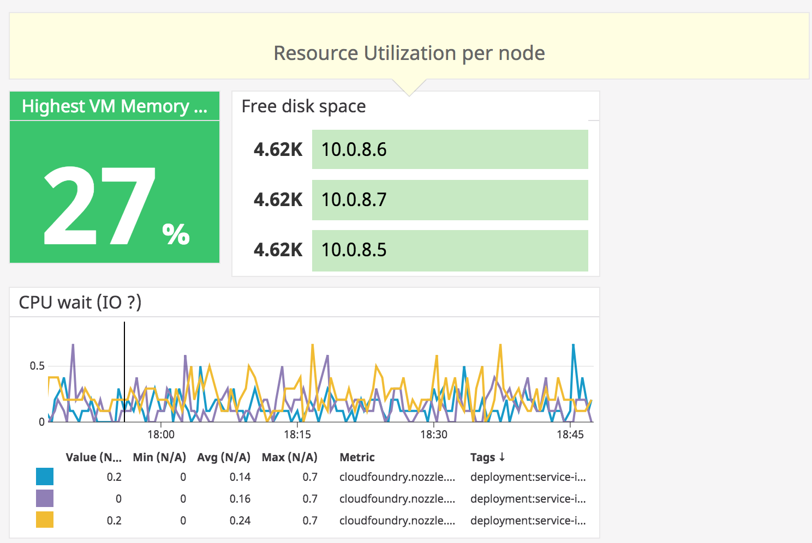

### Dashboard group - Load

*I want the dashboard to inform me if RabbitMQ is overloaded.*

First I define overloaded when some metric's value has exceeded certain average threshold. And second I need to define what are meaningful metrics to determine if RabbitMQ is loaded and that will depend on a case-by-case.

Here we could OS load metrics and/or Erlang load metric like the `run_queue`. We want to trace this metric overtime and determine acceptable threshold based on performance tests we ran in the past. [TO ADD to dashboard]

For IoT applications, the number of connections is a load factor. Hence, I want to have under the dashboard group called **Load** with the number of connections per node. Having the number of connections per node tells us if we have a balanced distribution of connections and it helps us identify which node could be running short of file descriptors.

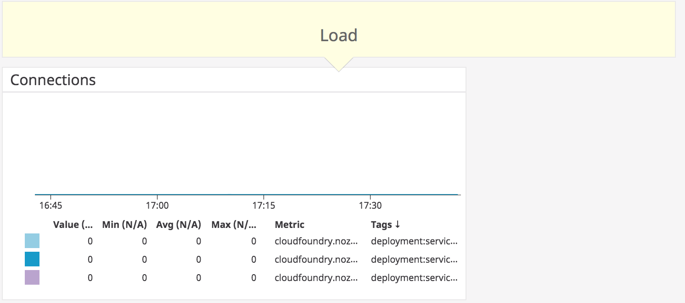

[TO ADD] How many connections are in [time-wait]( http://vincent.bernat.im/en/blog/2014-tcp-time-wait-state-linux.html)? This could limit the availability of our RabbitMQ service instance. This metric could also be part of the [Dashboard group - Availability](#Dashboard-group---RabbitMQ-Availability).
  > sample metric `system.net.tcp4.time_wait`


### Dashboard group - Throughput

*I want the dashboard to inform me if there is anything going in and out, its magnitude and more importantly if the incoming flow is at most equal or less than the outgoing flow.*

These are the key pieces of information that we will group under the label **Throughput**:
  - what is the incoming throughput? It is interesting to know it from a business perspective but also from a load analysis perspective.
  - what is the outgoing throughput? If it does not match the incoming we may have a problem.
  - are consumers quick enough consuming messages? and more specifically, acking messages? Or do we have a buggy consumer holding some acks?


### Dashboard group - Workload Specific

*I want the dashboard to inform me of the status/performance of some application's key resources.*

Here we are going from generic/overall monitoring to specific  monitoring. For instance, our application has a very critical queue that we need to closely monitor called `Pending Transactions`. This belongs to the workload called `Back-office connectivity` and therefore we create a dashboard group for it. For the application is crucial that the depth of the queue be below certain threshold and also that there is always at least one consumer.

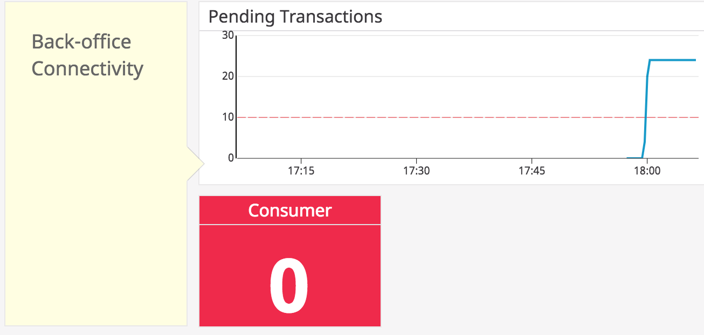

The type of widget or representation will depend on the complexity of the workload and also in our monitoring needs. In this sample dashboard, we use a [Query Value Widget](https://docs.datadoghq.com/graphing/widgets/query_value) that is very convenient when we only have a handful of critical queues and we want to see instant values. However, in more complex workloads with more queues we could opt for a [Top list widget](https://docs.datadoghq.com/graphing/widgets/top_list/) with the top ten/five queues sorted by consumer or by depth.


### Dashboard group - Mirroring (Optional)

*I want the dashboard to inform me of the mirroring state*

The key piece of information are:
  - Top 5 queues ordered by number of unsynchronized messages


### Dashboard group - Network (Optional)

*I want the dashboard to inform me of the network bandwidth utilization, specially compare traffic in/out to clients vs traffic between cluster nodes*

Maybe the cluster intercommunication is eating lots of bandwidth and affecting the applications' performance. This could be due to either too many mirrored queues or messaging routing between nodes.
  - cluster-link bandwidth usage


### Dashboard group - Federation and Shovels (Optional)

*I want the dashboard to inform me if the upstream link with the master/slave site is up and the throughput*

If our application uses the federation and/or shovel plugins we should monitor the *upstream link* state, specially if we are using Federation Exchanges because we can flood the *upstream queue*.


## Development workflow using one dashboard per RabbitMQ Service Instance

1. A developer creates a 3-node RabbitMQ cluster
    ```
    cf create-service p.rabbitmq plan-2 rmq
    ```

2. A developer creates a Datadog dashboard to monitor the service instance named `rmq` using the provided `sample` Dashboard template ([templates/samples.json](#templates/sample.json)). This dashboard template is the sample dashboard we have seen previously.
    ```
    export DATADOG_API_KEY=<theApiKey>
    export DATADOG_APP_KEY=<theAppKey>

    make create-dashboard service-instance=rmq template=sample
    ```

    It should print out:
    ```
    Created dashboard
    - id: uxy-m38-j56
    - title: RabbitMQ-system-dev-rmq-sample-dashboard
    - file: dashboards/uxy-m38-j56
    - url: https://app.datadoghq.com//dashboard/uxy-m38-j56/rabbitmq-system-dev-rmq-sample-dashboard
    ```

    This URL is not public yet so only authenticated Datadog users can access it. To make it public we have to go to the dashboard in Datadog and make it public.

    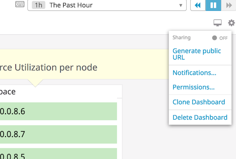  

3. A developer can access the dashboard via the provided URL in the previous command. Also, a developer can easily search for it for instance using part of the title which conveniently has the CF org, CF space, the service instance name and the dashboard template name.

    

4. A developer has made some changes to the dashboard and wants to keep those changes for future dashboards. A developer would only have to save the dashboard as a template and store the template in git for the future.
    ```
    make save-dashboard-as-template id=uxy-m38-j56 template=my-new-template
    ```
    ```
    git add templates/my-new-template.json
    git commit -m "Add new Datadog dashboard template"
    ```
    > We could override the existing `sample` template instead of creating a new one.


## Development workflow using one dashboard for many RabbitMQ Service Instances

1. A developer, or even an operator, has created a dashboard in Datadog to be used by developers to monitor their RabbitMQ clusters.

    It could have been created using the `make create-dashboard` command as shown below or any other way.
    ```
    export DATADOG_API_KEY=<theApiKey>
    export DATADOG_APP_KEY=<theAppKey>

    make create-dashboard service-instance=rmq template=sample
    ```

    It should print out:
    ```
    Created dashboard
    - id: uxy-m38-j56
    - title: RabbitMQ-system-dev-rmq-sample-dashboard
    - file: dashboards/uxy-m38-j56
    - url: https://app.datadoghq.com//dashboard/uxy-m38-j56/rabbitmq-system-dev-rmq-sample-dashboard
    ```


2. Another developer wants to use the dashboard to monitor its own RabbitMQ service instance.

    ```
    cf create-service p.rabbitmq plan-2 rmq2
    ...
    make get-dashboard-url service-instance=rmq2 id=uxy-m38-j56

    ```
    It prints out the url to the dashboard which configures via request parameters the dashboard template variable `service-instance` with the guid of the service instance we want to monitor.
    ```
    https://app.datadoghq.com/dashboard/uxy-m38-j56?tpl_var_service-instance=service-instance_2459413d-3dc1-4dcc-9e3c-6098d1a11fa7
    ```


## Uploading and downloading dashboards

Set up the datadog `API_KEY` and `APP_KEY`:
  ```
  export DATADOG_API_KEY=<theApiKey>
  export DATADOG_APP_KEY=<theAppKey>
  ```

To download a dashboard so that we can store it somewhere, e.g. in git. (it requires `curl` installed):
```
make get-dashboard id=7rd-sje-w2h
```
> It stores the dashboard in a file called dashboards/7rd-sje-w2h

> We can get the dashboard id from the browser url, e.g. `https://app.datadoghq.com/dashboard/7rd-sje-w2h/.....`

We have made local changes to a dashboard and want to update dashboard in Datadog:

```
make update-dashboard id=7rd-sje-w2h
```

To delete a dashboard :

```
make delete-dashboard id=7rd-sje-w2h
```
  > it will also delete the dashboard file

## Set up alerts

An alert should communicate something which is very meaningful to your system (this is your software system, not just RabbitMQ itself) so that if you do not take rapid measures it drastically affects it. For instance, if our application communicates with RabbitMQ over MQTT, regardless whether RabbitMQ has all nodes running, if the MQTT port is down, our application will experience downtime. It is not relevant at this point what could have caused it but, more importantly, that we are able to communicate the symptom via an alert.

Users, in general, care about a small number of things (Extracted from http://dtdg.co/philosophy-alerting):
  - **Basic availability and correctness**. RabbitMQ is available (even if not all nodes are up) and messaging should work according to the clients (i.e. messages are routed, messages are delivered)
  - **Latency/Throughput**
  - **Completeness/freshness/durability**. Your users data should be safe, should come back when you ask.
  - **Features**. Multi-site connectivity (is the federation upstream link up and working?) or STOMP availability (is it STOMP port healthy?)

If we agree those are the things that matter to us then we can define [SLA](https://en.wikipedia.org/wiki/Service-level_agreement)(s) for them. And because not every symptom requires immediate action, we can define [levels of alerting urgency](https://www.datadoghq.com/blog/monitoring-101-alerting/). For instance, **moderate severity** such as disk usage approaching the threshold, and **high severity** when the disk has breached the threshold.

### One monitor per service instance vs one for all service instances

There are two approaches:
  - Create one monitor that oversees **all** RabbitMQ services instances but sends an alert per each RabbitMQ service that triggers the monitor's condition

    

  - or create one per each RabbitMQ service instance

    
  
Having just one monitor is clearly simpler to manage however it comes with certain limitations:
  - We cannot mute it for some instances but on the other hand we can [schedule downtime](https://docs.datadoghq.com/monitors/downtimes/) and mute the alerts.
  - We can only use one set of thresholds for all instances
  - We cannot have different notification recipients

At the time of this writing, we chose to go for one monitor per RabbitMQ service instance. Although it may change in the future.

### Tagging our monitors

To make it easier to find and search for our monitors we are going to use the following tags:
  - `org:<cf_organization>`
  - `space:<cf_space>`
  - `instance:<rmq service instance name>`
  - `service_instance:rmq service instance guid`>

**TL;DR**: For convenience we use names rather than GUIDs except for the `service_instance` tag. Be aware that at any time those names may change if someone renamed the organization or space or service instance.

Once we have our monitors tagged, we can easily search for them using `tag:<KEY>:<VALUE>`:


### Messaging service availability monitor

The first SLA we are going to define is a **messaging service availability**:

  | Metric                     | Alert threshold | Warning threshold |            |
  | -------------------------- | --------------- | ----------------- | ----------------- |
| number of available nodes  | < 1             | < cluster size    |
| memory alarms              | > 0             |                   | Alarms will block producers affecting application SLA |
| disk alarms                | > 0             |                   | |
| amqp port ready            | < 1             |                   | If applications use other protocols a part from AMQP, the SLA should check them |

> These are other key resources that may affect the overall service availability if they are running low. Therefore we could add them to the list of metrics for this first SLA:
>  - memory
>  - disk
>  - file descriptors (https://www.rabbitmq.com/production-checklist.html#resource-limits-file-handle-limit)

Run the following command to create a monitor in your Datadog account so that you can edit it and see the configuration such as *detection method*, *metric*, *alert condition*, *alert message*, and *notification recipients*.
```
make create-monitors service-instance=rmq notif-recipient=myemail@address.com dashboard=uxy-m38-j56
```
  > We are creating a messaging service availability monitor for our rmq service instance.
  > Notifications will be sent to myemail@address.com with a link to the dashboard uxy-m38-j56

The command should print out:
```
Created monitor
  - id: 9481207
  - file: monitors/9481207
```

> **Limitations** : At the moment, this command creates a monitor with hard-coded thresholds. For instance, the warning threshold should be 2 for a 3 node cluster so that we get a warning when we lose one node. This must be auto-generated by querying the cluster and gathering the number of cluster nodes.  

If you want to see this monitor in action, check out the coming section [See monitors in action](#See-monitors-in-action)

### Messaging service correctness monitor

The second SLA we are going to define is a **messaging service correctness**:
  - number of connections/channels is not exceeding a defined threshold (if we have hard limits on connections and channels, breaching the limits will reduce applications SLA). Exceeding the threshold is seen as bad behaving applications.
  - rate of returned messages is exceeding certain threshold
  - rate of redelivered messages is exceeding certain threshold in the last minute
  - consumer anomaly ( ready messages - pending close <= threshold )

[WORK IN PROGRESS]

### Back-office transaction processing monitor

The third SLA we are going to define is a **back-office transaction processing**:
  - the depth of the critical queue, `pending-transactions` should not go beyond certain threshold
  - the number of consumers has dropped to zero and remained for several minutes.

[WORK IN PROGRESS]

### See monitors in action

To see the **messaging service available** monitor in action, we are going to stop one server so that we get a *warning alert*.

We should get an alert email. And another email when the situation is recovered.
  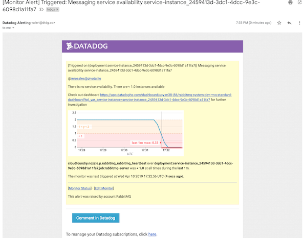 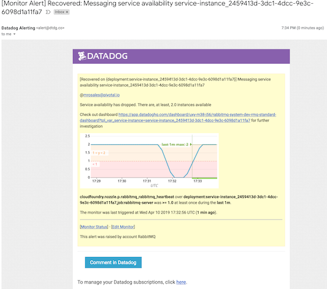

However, we can see this alerts and others in the *Event stream* which is very handy
  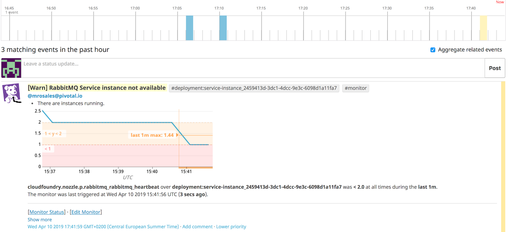

or also in the *Triggered* monitors screen


Additionally, the monitor itself provides us lots of timing information.
  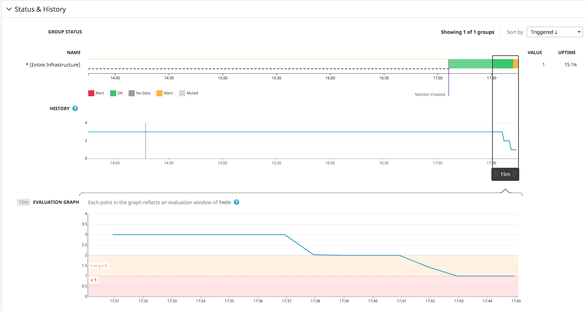


### Mute monitors when we do not want them to trigger

> https://docs.datadoghq.com/api/?lang=python#downtimes

## RabbitMQ Limits and Guard Rails

This topic goes beyond monitoring but it it worth discussing it. Any limits we configure in RabbitMQ is subject to be a threshold in our monitoring dashboard. It can be simply a marker in a time series, or it can be a threshold used to determine the color of a query value or it can be the threshold of an alarm/monitor.


These are the limit that only an Operator can set:
- [Queue Length Limit per vhost](https://www.rabbitmq.com/maxlength.html) - Via [operator policy](https://www.rabbitmq.com/parameters.html#operator-policies)
- [Message TTL per vhost](https://www.rabbitmq.com/ttl.html)  - Via [operator policy](https://www.rabbitmq.com/parameters.html#operator-policies)
- [Max connection per vhost](https://www.rabbitmq.com/vhosts.html#limits) - Via `rabbitmqctl` or HTTP api
- [Max queue per vhost](https://www.rabbitmq.com/vhosts.html#limits) - Via `rabbitmqctl`  or HTTP api
- [vm_memory_high_watermark globally](https://www.rabbitmq.com/configure.html) - Via `rabbitmq.config`
- [vm_memory_high_watermark_paging_ratio globally](https://www.rabbitmq.com/configure.html) - Via `rabbitmq.config`
- [disk_free_limit globally](https://www.rabbitmq.com/configure.html) - Via `rabbitmq.config`
- [channel_max globally](https://www.rabbitmq.com/configure.html) - Via `rabbitmq.config`

These are the limits that a developer can set via policies:
- [Queue Length Limit](https://www.rabbitmq.com/maxlength.html)
- [Message TTL](https://www.rabbitmq.com/ttl.html)

# Testing dashboards and alerts

TODO

## RabbitMQ server down

## Resource Churning
https://github.com/rabbitmq/workloads/tree/master/resource-churning
